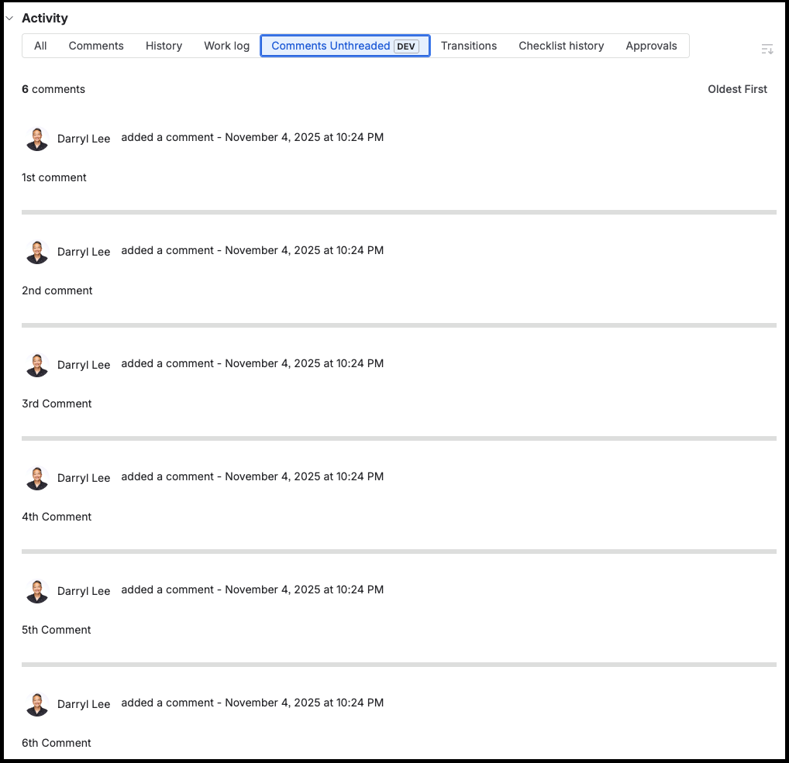

# Comments Unthreaded - Simple Jira Activity Tab

A hacky Jira Forge app that provides an unthreaded view of issue comments.

Inspired by Brian Stinar's comment on [JRACLOUD-93678 - Ability to configure Threaded Comments in Jira](https://jira.atlassian.com/browse/JRACLOUD-93678?focusedId=3720932&page=com.atlassian.jira.plugin.system.issuetabpanels%3Acomment-tabpanel#comment-3720932)

Written by [Rovo Dev CLI](https://community.atlassian.com/forums/Rovo-for-Software-Teams-Beta/Introducing-Rovo-Dev-CLI-AI-Powered-Development-in-your-terminal/ba-p/3043623) with [Forge MCP Server](https://developer.atlassian.com/platform/forge/forge-mcp/)

**NOTE: This is the "Simple" version. If you like bells and whistles (filtering, search, analytics), you should check out the [Deluxe version](https://bitbucket.org/rudebadmood/unthreaded/src/simple/)**

### Screenshot


## Features

### Core Functionality
- **Unthreaded Comments View**: Display all issue comments in a clean, chronological list without threading complexity
- **Simple Sorting**: Toggle between chronological (oldest first) and reverse chronological (newest first) ordering
- **Clean Display**: Each comment shows the author, timestamp, and content in an easy-to-read format

### User Experience
- **Minimal Interface**: No clutter - just comments displayed clearly
- **User Avatars**: Display comment authors with proper user components
- **Error Handling**: Graceful error states and loading indicators
- **Responsive Design**: Uses Atlassian Design System components for consistent styling

## Setup and Deployment

1. Install dependencies:
   ```bash
   npm install
   ```

2. Register the app:
   ```bash
   forge register 'Unthreaded Comments'
   ```

3. Build the app:
   ```bash
   forge build
   ```

4. Deploy the app:
   ```bash
   forge deploy
   ```

5. Install the app to your Jira site:
   ```bash
   forge install
   ```

## How It Works

This app adds a "Comments Unthreaded" tab to the Activity section of Jira issues. Unlike the default threaded comment view, this provides:

- **Linear Timeline**: All comments displayed in a single, easy-to-scan list
- **Simple Navigation**: No nested threads - just a clean chronological flow
- **Quick Overview**: See total comment count and easily switch between oldest/newest first

## Technical Architecture

### Backend (`src/index.js`)
- **Resolver Functions**: Two main resolvers for fetching comments and issue context
- **Jira API Integration**: Uses Jira REST API v3 to fetch comment data with proper ordering
- **Error Handling**: Comprehensive error handling with detailed error responses

### Frontend (`src/frontend/index.jsx`)
- **React Components**: Built with Forge UI Kit components for consistent Atlassian design
- **Simple State Management**: Basic state handling for comments, loading, and sort order
- **ADF Processing**: Simple function to extract text content from Atlassian Document Format

## File Structure

- `manifest.yml` - Forge app configuration defining the jira:issueActivity module
- `src/index.js` - Backend resolver functions for API calls
- `src/frontend/index.jsx` - React frontend with comment display and filtering logic
- `package.json` - Dependencies including Forge React, API, and Bridge packages

## Permissions

The app requires:
- `read:jira-work` - To access issue comments and metadata

## Use Cases

- **Long Discussion Threads**: Simplify navigation through extensive comment histories
- **Timeline Review**: Understand the chronological flow of issue discussions without threading complexity
- **Quick Overview**: Get a simple count and clean view of all comments on an issue
- **Better Readability**: Focus on content without the distraction of nested thread structures
